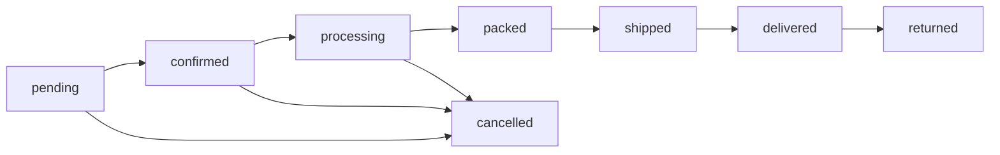

# 📋 Module 09: Order Management

## Overview

অনলাইন অর্ডার ম্যানেজমেন্ট — অর্ডার তৈরি থেকে ডেলিভারি পর্যন্ত পুরো workflow।

---

## Database Schema

### `orders` Table

```sql
CREATE TABLE orders (
    id                  BIGINT UNSIGNED AUTO_INCREMENT PRIMARY KEY,
    order_number        VARCHAR(50) UNIQUE NOT NULL,     -- ORD-2026-0001
    customer_id         BIGINT UNSIGNED NOT NULL,
    address_id          BIGINT UNSIGNED NULL,

    -- Shipping info snapshot (in case address changes later)
    shipping_name       VARCHAR(255) NULL,
    shipping_phone      VARCHAR(20) NULL,
    shipping_address    TEXT NULL,
    shipping_division   VARCHAR(100) NULL,
    shipping_district   VARCHAR(100) NULL,
    shipping_upazila    VARCHAR(100) NULL,

    subtotal            DECIMAL(12,2) NOT NULL DEFAULT 0,
    discount_amount     DECIMAL(12,2) DEFAULT 0,
    delivery_charge     DECIMAL(12,2) DEFAULT 0,
    tax                 DECIMAL(12,2) DEFAULT 0,
    grand_total         DECIMAL(12,2) NOT NULL DEFAULT 0,
    paid_amount         DECIMAL(12,2) DEFAULT 0,

    status              ENUM('pending', 'confirmed', 'processing', 'packed', 'shipped', 'delivered', 'cancelled', 'returned') DEFAULT 'pending',
    payment_method      ENUM('cod', 'bkash', 'nagad', 'card', 'other') DEFAULT 'cod',
    payment_status      ENUM('unpaid', 'partial', 'paid', 'refunded') DEFAULT 'unpaid',

    delivery_method     ENUM('shop_delivery', 'courier', 'pickup') DEFAULT 'shop_delivery',
    courier_name        VARCHAR(255) NULL,
    tracking_number     VARCHAR(255) NULL,
    delivery_date       DATE NULL,

    customer_note       TEXT NULL,
    admin_note          TEXT NULL,

    confirmed_at        TIMESTAMP NULL,
    packed_at           TIMESTAMP NULL,
    shipped_at          TIMESTAMP NULL,
    delivered_at        TIMESTAMP NULL,
    cancelled_at        TIMESTAMP NULL,

    created_at          TIMESTAMP,
    updated_at          TIMESTAMP,

    FOREIGN KEY (customer_id) REFERENCES customers(id),
    FOREIGN KEY (address_id) REFERENCES customer_addresses(id) ON DELETE SET NULL,
    INDEX (order_number),
    INDEX (customer_id),
    INDEX (status),
    INDEX (payment_status),
    INDEX (created_at)
);
```

### `order_items` Table

```sql
CREATE TABLE order_items (
    id                  BIGINT UNSIGNED AUTO_INCREMENT PRIMARY KEY,
    order_id            BIGINT UNSIGNED NOT NULL,
    product_variant_id  BIGINT UNSIGNED NOT NULL,

    -- Snapshot data (in case product changes later)
    product_name        VARCHAR(255) NOT NULL,
    variant_name        VARCHAR(255) NULL,

    quantity            DECIMAL(12,4) NOT NULL,
    unit_id             BIGINT UNSIGNED NOT NULL,
    base_quantity       DECIMAL(12,4) NOT NULL,
    unit_price          DECIMAL(12,2) NOT NULL,
    discount            DECIMAL(12,2) DEFAULT 0,
    subtotal            DECIMAL(12,2) NOT NULL,
    created_at          TIMESTAMP,
    updated_at          TIMESTAMP,

    FOREIGN KEY (order_id) REFERENCES orders(id) ON DELETE CASCADE,
    FOREIGN KEY (product_variant_id) REFERENCES product_variants(id),
    FOREIGN KEY (unit_id) REFERENCES units(id)
);
```

### `order_status_logs` Table

```sql
CREATE TABLE order_status_logs (
    id          BIGINT UNSIGNED AUTO_INCREMENT PRIMARY KEY,
    order_id    BIGINT UNSIGNED NOT NULL,
    from_status VARCHAR(50) NULL,
    to_status   VARCHAR(50) NOT NULL,
    note        TEXT NULL,
    changed_by  BIGINT UNSIGNED NULL,
    created_at  TIMESTAMP,

    FOREIGN KEY (order_id) REFERENCES orders(id) ON DELETE CASCADE,
    FOREIGN KEY (changed_by) REFERENCES users(id) ON DELETE SET NULL
);
```

---

## Order Status Workflow



### Status Actions

| Status       | Action By | Effect                                  |
| ------------ | --------- | --------------------------------------- |
| pending      | Customer  | Stock reserved                          |
| confirmed    | Admin     | Order accepted                          |
| processing   | Admin     | Packing started                         |
| packed       | Admin     | Ready for dispatch                      |
| shipped      | Admin     | Handed to courier, tracking added       |
| delivered    | Admin     | Stock deducted, reserved released       |
| cancelled    | Admin/Cust| Reserved stock released                 |
| returned     | Admin     | Stock returned (movement: return_in)    |

---

## Laravel Files to Create

### Models

```
app/Models/Order.php
app/Models/OrderItem.php
app/Models/OrderStatusLog.php
```

### Migrations

```
database/migrations/xxxx_create_orders_table.php
database/migrations/xxxx_create_order_items_table.php
database/migrations/xxxx_create_order_status_logs_table.php
```

### Service

```
app/Services/OrderService.php
```

### Livewire Components (Admin)

```
resources/views/app/⚡orders/page.blade.php           — Order List
resources/views/app/⚡orders/page.php
resources/views/app/⚡order-detail/page.blade.php     — Order Detail
resources/views/app/⚡order-detail/page.php
```

### Routes

```php
// Admin
Route::livewire('/app/orders/', 'app::orders')->name('app.orders');
Route::livewire('/app/orders/{order}', 'app::order-detail')->name('app.orders.detail');
```

---

## Features — Admin Order List

### Dashboard Cards

| New Orders (pending) | Today's Orders | Total Revenue (today) | Cancelled |
|---------------------|----------------|----------------------|-----------|

### Order Table

| Order # | Date | Customer | Items | Total | Payment | Status | Actions |
|---------|------|----------|-------|-------|---------|--------|---------|

### Filters
- Status (tabs: All, Pending, Confirmed, Processing, Shipped, Delivered, Cancelled)
- Date range
- Payment status
- Customer search
- Payment method

---

## Features — Admin Order Detail

### Layout

```
┌──────────────────────────────────────────────────────┐
│ Order #ORD-2026-0042                                 │
│ Status: [confirmed ▼]    Payment: [unpaid]           │
├────────────────────────────┬─────────────────────────┤
│ Customer Info              │ Shipping Info            │
│ Name: রহিম                │ Address: Gazipur...      │
│ Phone: 017...              │ Division: Dhaka          │
│ Email: —                   │ Method: Courier          │
├────────────────────────────┴─────────────────────────┤
│ Order Items                                          │
│ ┌────────┬──────────┬─────┬───────┬────────┐        │
│ │Product │ Variant   │ Qty │ Price │ Total  │        │
│ ├────────┼──────────┼─────┼───────┼────────┤        │
│ │Urea    │ 50kg bag  │ 2   │ 1200  │ 2400   │        │
│ │Confidor│ 100ml     │ 5   │ 350   │ 1750   │        │
│ └────────┴──────────┴─────┴───────┼────────┤        │
│                         Subtotal  │ 4150   │        │
│                         Delivery  │  100   │        │
│                         Total     │ 4250   │        │
├──────────────────────────────────────────────────────┤
│ Status History / Timeline                            │
│ ● pending   — 09/03/2026 10:00 AM                   │
│ ● confirmed — 09/03/2026 10:30 AM (by Admin)        │
├──────────────────────────────────────────────────────┤
│ [Confirm] [Pack] [Ship] [Deliver] [Cancel]           │
│ [Add Tracking] [Print Invoice] [Add Note]            │
└──────────────────────────────────────────────────────┘
```

---

## Stock Flow on Order Lifecycle

```php
// 1. Order Placed → Reserve Stock
foreach ($orderItems as $item) {
    $inventoryService->reserveStock($item->product_variant_id, $item->base_quantity);
}

// 2. Order Delivered → Deduct Stock + Release Reserved
foreach ($orderItems as $item) {
    $inventoryService->deductSaleStock($item->product_variant_id, ...);
    $inventoryService->releaseReservedStock($item->product_variant_id, $item->base_quantity);
}

// 3. Order Cancelled → Release Reserved
foreach ($orderItems as $item) {
    $inventoryService->releaseReservedStock($item->product_variant_id, $item->base_quantity);
}

// 4. Order Returned → Add Stock Back
foreach ($orderItems as $item) {
    $inventoryService->addReturnStock($item->product_variant_id, ...);
}
```

---

## OrderService

```php
class OrderService
{
    public function createOrder(Customer $customer, array $items, array $data): Order
    public function confirmOrder(Order $order): void
    public function packOrder(Order $order): void
    public function shipOrder(Order $order, ?string $courier, ?string $tracking): void
    public function deliverOrder(Order $order): void
    public function cancelOrder(Order $order, string $reason): void
    public function returnOrder(Order $order, array $returnItems, string $reason): void
    public function changeStatus(Order $order, string $newStatus, ?string $note): void
}
```

---

## Notifications

| Event            | Notify Customer     | Notify Admin               |
| ---------------- | ------------------- | -------------------------- |
| Order placed     | ✅ Email/Push        | ✅ Push + Dashboard alert   |
| Order confirmed  | ✅ Email/Push        | —                          |
| Order shipped    | ✅ Email/Push + SMS  | —                          |
| Order delivered  | ✅ Email/Push        | —                          |
| Order cancelled  | ✅ Email/Push        | ✅ Push                     |

---

## Permissions

```
orders.view         — View orders
orders.manage       — Change status, add tracking
orders.cancel       — Cancel orders
orders.return       — Process returns
orders.print        — Print order invoice
```

---

## Sidebar Menu

```blade
<x-menu-sub title="Orders" icon="o-shopping-bag">
    <x-menu-item title="All Orders"    icon="o-list-bullet"    link="/app/orders" />
    <x-menu-item title="Pending"       icon="o-clock"          link="/app/orders?status=pending" />
    <x-menu-item title="Processing"    icon="o-arrow-path"     link="/app/orders?status=processing" />
</x-menu-sub>
```

---

## Auto-Generated Order Number

```php
public static function generateOrderNumber(): string
{
    $year = now()->format('Y');
    $last = self::whereYear('created_at', $year)->max('id') ?? 0;
    return sprintf('ORD-%s-%04d', $year, $last + 1);
}
```
